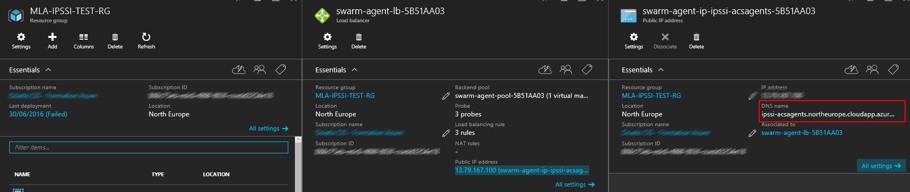

# Deploy something in Azure Container Service (ACS) - Docker SWARM
## Overview

1. Configure our desktop environment
2. Create an Azure Container Service with Docker Swarm
3.

This documentation was created with an Ubuntu 16.04

## Configure our desktop environment
To use an ACS with Docker Swarm, you need this requirements:
1. Install a default Ubuntu 16.04 : You could be find an Ubuntu distribution [here](http://www.ubuntu.com/download/desktop)
2. Install Node-JS and npm
3. Install Docker
4. Install docker-compose
5. Install Azure-cli

### Install Node-JS and npm
Documentation could be find [here](https://doc.ubuntu-fr.org/nodejs)

To install nodejs and npm, use this following command:

    sudo apt-get update && sudo apt-get install nodejs npm
    sudo apt-get install nodejs-legacy

### Install Docker
Documentation could be find [here](https://docs.docker.com/engine/installation/linux/ubuntulinux/)

install the linux-image-extra package for your kernel version

    sudo apt-get update
Install the linux-image-extra package

    sudo apt-get install linux-image-extra-$(uname -r)
Install Docker

    sudo apt-get install docker-engine

### Install Docker Compose
Documentation could be find [here](https://docs.docker.com/compose/)

First install Docker compose

    sudo apt install docker-compose

Next, get last version of docker compose (Compose repository release page on GitHub is [here](https://github.com/docker/compose/releases))

    curl -L https://github.com/docker/compose/releases/download/1.8.0-rc1/docker-compose-`uname -s`-`uname -m` > ./docker-compose
    chmod +x ./docker-compose
    sudo cp -f docker-compose /usr/bin/docker-compose
Check our version

    docker-compose --version

### Install Azure-Cli
Documentation could be find [here](https://azure.microsoft.com/fr-fr/documentation/articles/xplat-cli-install/)

    sudo npm install azure-cli -g

## Create an Azure Container Service with Docker Swarm
In this step, you need to:
1. Setup Azure Cli environment
2. Deploy Azure Container Service via ARM
3. Connect to our cluster

### Setup Azure Cli environment
First, add our azure account

    azure login -u user@domain.com

Configure the Azure CLI tools to use Azure Resource Manager

    azure config mode arm

### Deploy Azure Container Service via ARM
Documentation could be find [here](https://azure.microsoft.com/en-us/documentation/articles/container-service-deployment/)

Create Azure Resource Group

    rgname='OUR RESOURCE GROUP NAME' (eg: SWARM-RG)
    location='OUR LOCATION' (eg: northeurope)
    azure group create $rgname $location

You need to create a SSH Key. You could use the following command to do this:

    ssh-keygen

Next, we use an existing template provide by Microsoft (This template could be found [here](https://github.com/Azure/azure-quickstart-templates/blob/master/101-acs-swarm/docs/SwarmWalkthrough.md))

    templateURI='https://raw.githubusercontent.com/Azure/azure-quickstart-templates/master/101-acs-dcos/azuredeploy.json'

Get the paramters File required for the deployment

    wget https://github.com/Azure/azure-quickstart-templates/blob/master/101-acs-swarm/azuredeploy.parameters.json

After, get our own public key and change the parameter sshRSAPublicKey in our parameters file with our own ssh public key.. It could be found here : `cat ~/.ssh/id_rsa.pub`

    "sshRSAPublicKey": {
      "value": "OUR SSH PUBLIC KEY"
    }
Set a variable for our parameters file

    parametersFile='./azuredeploy.parameters.json'
Finally, create the Swarm cluster

    azure group deployment create $rgname 'ACSDeployment' --template-uri $templateURI -e $parametersFile
### Connect to our cluster, setup docker environment and test it
Documentation could be found [here](https://azure.microsoft.com/en-us/documentation/articles/container-service-connect/)

Create a DC-OS Tunnel (WARNING : id_rsa must be in /root/.ssh folder ; ssh tunnel should be initiate only by root user. Use this following command to do this: `sudo cp ~/.ssh/id_rsa* /root/.ssh/`)

    sudo ssh -L 2375:localhost:2375 -f -N username@masteragentname.location.cloudapp.azure.com -p 2200
set your DOCKER_HOST environment variable as follows

    export DOCKER_HOST=:2375
Now, you could run First container. This example (from Microsoft) creates a container from the yeasy/simple-web image:

    docker run -d -p 80:80 yeasy/simple-web
    docker run -d -p 80:80 -v /azureshare:/data yeasy/simple-web
Go to url (FQDN name of Public IP Adress of Load Balancer Agent). This url is the DNS name of the Load Balancer Agent

Now, you could create a docker compose file

Setup
    http://ipssi-acs-swarmagents.northeurope.cloudapp.azure.com/

	# docker-compose
	https://github.com/eea/eea.docker.jenkins
	https://engineering.riotgames.com/news/jenkins-docker-proxies-and-compose
	https://github.com/Azure/azure-quickstart-templates/blob/master/101-acs-swarm/docs/SwarmWalkthrough.md

	# DCOS
	https://github.com/Azure/azure-quickstart-templates/blob/master/101-acs-dcos/docs/DCOSWalkthrough.md
