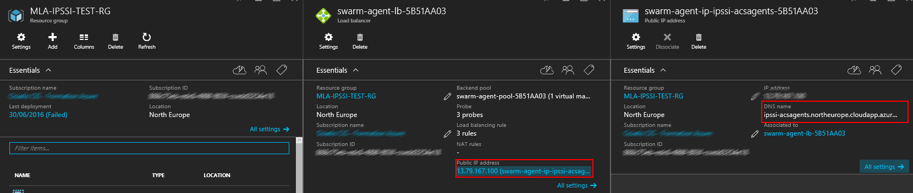
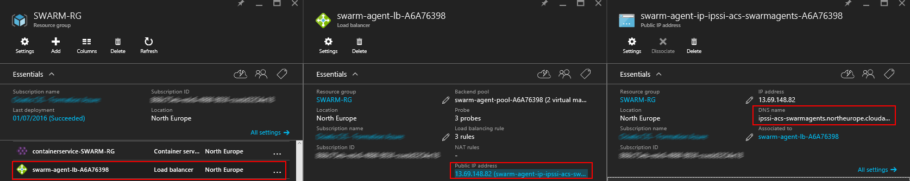
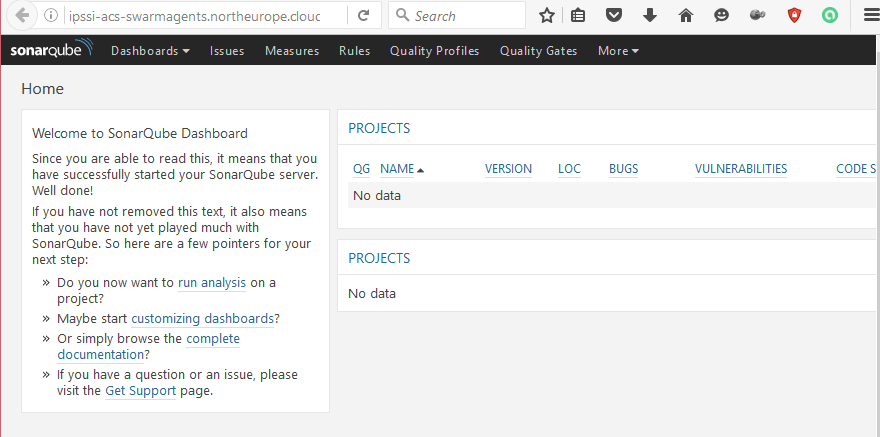

# Tutorial 2 - setup a sonarqube instance
## Overview

This tutorial is a part of [Azure Container Service and Docker Swam Tutorials](README.md)

Sonarqube is an open source quality management platform. It is a very good solution to analyzing and measuring the technical quality of source code.

Create a true production instance is a bit complex. To create a Sonarqube instance, we need:

1. Create a persistent data volumes: to do this, we will used the docker azurefile-dockervolumedriver. This plugin is available [here](https://github.com/Azure/azurefile-dockervolumedriver)
2. Create a postgresql instance: an existing docker image is available [here](https://hub.docker.com/_/postgres/)
3. Create a sonarqube instance: an existing docker image is available [here](https://hub.docker.com/_/sonarqube/)

## Install docker azurefile-dockervolumedriver plugin
cifs-utils is need to do this. Enjoy, it is already installed on ACS Swarm Agent

First, you need to create a storage account. We will use a Azure Storage File. More information about it is [here](https://azure.microsoft.com/en-us/documentation/articles/storage-dotnet-how-to-use-files/)

    azure storage account create YOUR_ACCOUNT_NAME
Connect to Swarm Master with this following command

    ssh username@swarmmastername.location.cloudapp.azure.com -p 2200

The Swarm master url could be find here:

Now, you need information about agent. You could use this command: `docker info`.

    maxime@ubuntu:~/AzureContainerService/docker/service$ docker info
    Containers: 3
     ...
    Nodes: 2
     swarm-agent-A6A76398000001: 10.0.0.5:2375
      └ Status: Healthy
      └ Containers: 1
      └ Reserved CPUs: 0 / 2
      └ Reserved Memory: 0 B / 3.528 GiB
      └ Labels: executiondriver=, kernelversion=3.19.0-64-generic, operatingsystem=Ubuntu 14.04.4 LTS, storagedriver=aufs
      └ Error: (none)
      └ UpdatedAt: 2016-07-02T21:12:26Z
     swarm-agent-A6A76398000003: 10.0.0.7:2375
      └ Status: Healthy
      └ Containers: 2
      └ Reserved CPUs: 0 / 2
      └ Reserved Memory: 0 B / 3.528 GiB
      └ Labels: executiondriver=, kernelversion=3.19.0-64-generic, operatingsystem=Ubuntu 14.04.4 LTS, storagedriver=aufs
      └ Error: (none)
      └ UpdatedAt: 2016-07-02T21:12:35Z
    ...
For the first agent, connect to it with this command

    ssh maxime.launay@agentIP
Get the three files need to setup the plugin

    wget https://github.com/Azure/azurefile-dockervolumedriver/releases/download/0.2.1/azurefile-dockervolumedriver
    wget https://raw.githubusercontent.com/Azure/azurefile-dockervolumedriver/master/contrib/init/upstart/azurefile-dockervolumedriver.conf
    wget https://raw.githubusercontent.com/Azure/azurefile-dockervolumedriver/master/contrib/init/upstart/azurefile-dockervolumedriver.default
Now, edit the file azurefile-dockervolumedriver.default. You need to update the parameter `AF_ACCOUNT_NAME` by the name of your storage account and the parameter `AF_ACCOUNT_KEY` by the key.

    NT_NAME=youraccount
    AF_ACCOUNT_KEY=yourkey
To get the account key, you could use the following command

    azure storage account keys list YOUR_ACCOUNT_NAME
Finally, setup and start the plugin

    chmod +x azurefile-dockervolumedriver
    sudo cp azurefile-dockervolumedriver /usr/bin
    sudo cp azurefile-dockervolumedriver.conf /etc/init
    sudo cp azurefile-dockervolumedriver.default /etc/default/azurefile-dockervolumedriver
    sudo initctl reload-configuration
    sudo initctl start azurefile-dockervolumedriver

## Install postgresql
first, create a `docker-compose.yml` file

Add the following line. It is mandatory ; networks, services or volumes are not available at the lower version of docker-compose

    version: "2"
Add lines to create a persistent data volumes using azure file

    volumes:
      sonarDb:
        driver: azurefile
        driver_opts:
          share: "sonardb"

add also lines to create a sonar network

    networks:
      sonarnet:
        driver: overlay
Finally, add the service sonardb

    services:
      sonarDb:
        image: postgres
        networks:
          - sonarnet
        environment:
          - POSTGRES_USER=sonar
          - POSTGRES_PASSWORD=sonar
        volumes:
          - sonarDb:/var/lib/postgresql

You could try your postgresql instance with the following command

    docker-compose up -d
## Install sonarqube instance

You are ready to install the sonarqube instance in docker.

First, add the following line in the volumes section of your docker-compose file

      sonarqube_conf:
        driver: azurefile
        driver_opts:
          share: "sonarqubeconf"
      sonarqube_data:
        driver: azurefile
        driver_opts:
          share: "sonarqubedata"
      sonarqube_exts:
        driver: azurefile
        driver_opts:
          share: "sonarqubeexts"
      sonarqube_plugs:
        driver: azurefile
        driver_opts:
          share: "sonarqubeplugs"
And add these lines in the services section

      sonarqube:
        image: sonarqube
        ports:
          - "8080:9000"
        networks:
          - sonarnet
        environment:
          - SONARQUBE_JDBC_URL=jdbc:postgresql://sonarDb:5432/sonar
        volumes:
          - sonarqube_conf:/opt/sonarqube/conf
          - sonarqube_data:/opt/sonarqube/data
          - sonarqube_exts:/opt/sonarqube/extensions
          - sonarqube_plugs:/opt/sonarqube/lib/bundled-plugins

To Verify your installation, you could be to connect to sonar url (please remember the sonarqube port is 8080)

      http://agentIP.cloudapp.azure.com:8080
The Swarm master url could be find here:

the result is a fresh sonarqube instance

## TO DO
scale up sonar instance
using a SaaS postgresql
